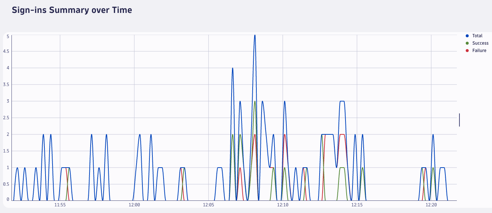

# User Account Brute-force

<br>

- [Spin-up the use-case](#spin-up-the-use-case)
- [Use-case](#use-case)
  - [Introduction and Goals](#introduction-and-goals)
  - [Prerequisites](#prerequisites)
  - [Scenario Description](#scenario-description)
  - [Attack Simulation](#attack-simulation)
  - [Monitor User Sign-ins](#monitor-user-sign-ins)
  - [Detect the Attack](#detect-the-attack)
  - [Automate the Detection](#automate-the-detection)
  - [Operationalize Security Events](#operationalize-security-events)
- [Summary](#summary)

<br>

## Spin-up the use-case
The present use-case leverages on the [ACE-Box](https://github.com/Dynatrace/ace-box/tree/dev) framework to setup and configure the Dynatrace environment and all the needed resources to reproduce the intended scenario.

In order to prepare the environment and resources to reproduce the use-case, it's needed to configure the ACE-Box to spin-up an external use-case by following the instructions available [here](https://github.com/Dynatrace/ace-box/blob/dev/Readme.md).

The present use-case must be configured as an ACE-Box custom use-case, and it is defined in the following [repository](https://github.com/dynatrace-ace/ace-box-ext-demo-threat-detection.git).

*Notes*:
  - If you can't access the [ACE-Box](https://github.com/Dynatrace/ace-box/tree/dev) repository, [here's]() how to request access
  - If you can't access the [Use-case](https://github.com/dynatrace-ace/ace-box-ext-demo-threat-detection.git) repository, [here's]() how to request access

<br><br>

## Use-case

### Introduction and Goals
This use-case aims at demonstrating how to use Dynatrace platform to detect _password spray_ attempts towards user accounts by analyzing and querying [Microsoft Entra ID sign-in logs](https://learn.microsoft.com/en-us/entra/identity/monitoring-health/concept-sign-ins).

The main **goals** of the present use-case are:
1. Show how to setup and use Dyntrace to monitor sign-in user activities through Microsoft Entra ID sign-in logs
2. Show how to automatically detect password spray attempts towards users and raise custom security events
3. Demonstrate how to extract counter metrics from ingested logs through OpenPipeline

<br>

### Prerequisites
- Knowledge of [Dynatrace Query Language](https://docs.dynatrace.com/docs/discover-dynatrace/references/dynatrace-query-language)

<br>

### Scenario Description
Password spray attacks are a type of brute-force attack where an attacker attempts to gain unauthorized access to multiple user accounts by using a limited set of commonly used passwords.

Unlike traditional brute-force attacks that target a single account with multiple password guesses, password spray attacks try a few common passwords across a wide range of accounts to avoid triggering account lockout mechanisms. This technique allows attackers to remain under the radar while exploiting weak or commonly used passwords.

Password spray is particularly effective when organizations have many users with predictable passwords or when password policies are not strictly enforced. Attackers often leverage publicly available information or breach data to identify potential usernames or email addresses, and then test these accounts using a small list of popular passwords. By spreading out the attempts across many accounts, they minimize detection and maximize the chance of success.

#### Attack Pattern Detection - Key Indicators
- **Multiple failed login attempts across different accounts and short time-window**: a high volume of failed login attempts across multiple accounts within a short time window (10 minutes)
- **Same IP address targeting multiple accounts**: repeated login attempts originating from the same IP address targeting different user account
- **Sign-in error code**: failed sign-ins reporting specific error codes indicating wrong credentials provided by the user


#### Detection Logic
1. Identify, separately for each IP address, all the 10-minutes time windows in which there are at least 10 different users failing the sign-in with a specific error code
2. Check if the same users have performed any successful sign-in within the identified attackWindow or in the next 30-minutes

> **Note**: the time window duration and the number of failed sign-ins are configured as thresholds and they can be changed and fine-tuned.

<br>

### Attack Simulation
Follow the steps below to simulate a brute-force attack:

1. Go to the Dynatrace environment, browse to the Dynatrace Workflow section and open the "_Brute-force Azure Sign-In Logs Upload_" workflow.

    

    This is a simple workflow which is executing a javascript code to generate and upload a set of mocked Microsoft Entra ID sign-in logs simulating a password spray attack.<br>
    Run the workflow and wait for the execution to be completed.<br>

    > **Note**: the workflow is accurately reproducing the [Microsoft ID sign-in log format](https://learn.microsoft.com/en-us/azure/azure-monitor/reference/tables/signinlogs).

<br>

### Monitor User Sign-ins
> **Note**: the following sections assume you have simulated the brute-force attack with option n.1 (using the workflow)

<br>

Let's take a look at the logs.

Head to the Dashboards App and open the _Azure Monitoring Dashboard_. Set the timeframe to the last hour and let's take a look at the logs.

First of all, the dashboard offers a summary of the latest logs, counting the total amount, the failing and successful ones:



<br>

In addition, by scrolling down you can get details on the location from where the sign-in activities were performed, the device OS and browser used and the accessed application.

On top of that, the dashboard has a further section that focuses on failed sign-in attempts and provides the trend over time and a ranking of the most failing IP addresses within the selected timeframe:


<br>


<br>

By taking a closer look at the last sections, it seems that there is an anomalous situation for IP address `78.79.80.82`, as it was used to perform `26` failed sign-in attempts for a large number of different users over the last 30 minutes and so it is possible that it was used to attempt a password spray attack. Let's have a deep dive.

<br>

### Detect the Attack
Go to the Notebook section and open the _Password Spray_ notebook.

This notebook aims at providing an overview of the malicious pattern to be detected in the logs, and a step-by-step description of the detection logic. Once opened, let's reload the entire notebook content by clicking on the button at the top right part of the screen.

**Note**: to get the DQL query details, just click on the _Show input_ button on the target section

<br>

1. The first section highlights the number of failed sign-in attempts by IP address within the last 30-minutes. Again, it is possible to see that `78.79.80.82` has performed `26` failed sign-in attempts, while other IP addresses have been involved in a lot smaller number of failed some sign-in attempts:

    

<br>

2. The second section enters in the core of the brute-force detection logic and it identifies all the `10-minutes` time windows with at least `10` failing the sign-in attempts by `10` different users and with a specific error code:

    
    
    <br>

    

    <br>
    Those windows represent a potential time frame where a password spray attack has been attempted.

<br>

3. The third sections aims at fetching all seccessful sign-ins performed by the target user within the last 30-minutes:

    

    <br>

    As reported by the above image, two different users have been observed to perform successful sign-ins using `78.79.80.82` IP address.<br>
    In addition, since they fall within the identified potential attack time windows, they can be considered as risky sign-ins, because they could represent the successful sign-ins performed by the attacker that have guessed the users credentials.

<br>

4. The fourth and final section is cross-referencing all the data:
   - Identify, separately for each IP address, all the `10-minutes` time windows in which there are at least `10` different users failing the sign-in
   - Checks if the same IP address have been used to perform any successful sign-in within the identified attack-window or in the next 30-minutes
   
   IP address `78.79.80.82` is matching those conditions and the query output reports the three risky sign-in attempts:

    

    <br>

   Here there is the full DQL query to detect password spray attempts:

   ```
    // Step-1: group records by IP and timestamp
    timeseries failedSignInsTimeSeries = count(log.azure.failed.user.signins), by:{ipAddress, AzureTimestamp, resultString}, interval: 1m
    | summarize {
        failedSignInCount = countIf(resultString == "50126")
    },
    by:{ipAddress, AzureTimestamp}
    | fieldsRename AzureTimestamp, startTime

    /**
    Step-2: for each IP Address that has been observed to fail for at least 10 distinct users,
    get all the failing sign-in timestamps in the whole time window and put them into an array
    **/
    | join on:{ipAddress}, [
    timeseries failedSignInsTimeSeries = count(log.azure.failed.user.signins), by:{ipAddress, userPrincipalName, AzureTimestamp, resultString}, interval: 1m
    | filter resultString == "50126"
    | summarize {
        tsArray = collectArray(AzureTimestamp),
        countDistinctUsers = countDistinct(userPrincipalName)
        },
    by:{ipAddress}
    | filter countDistinctUsers > 10
    ]

    // Step-3: expand the array and remove from it all the timestamps which are before the potentially malicious time window (timestamp --> timestamp + 10minutes)
    | expand right.tsArray
    | filter right.tsArray > startTime and right.tsArray <= (startTime + 10m)

    // Step-4: count failed sign-in attempts for each user and malicious window startTime
    | summarize countFailures = count(), by:{ipAddress, startTime}
    | fieldsAdd endTime = startTime + 10m
    | fieldsAdd attackWindow = timeframe(from:startTime, to:endTime)

    // // Step-5: keep windows with at least 15 failures for that user
    | filter countFailures > 10

    // Step-6: look for success sign-ins
    | join on: {ipAddress}, [
    timeseries failedSignInsTimeSeries = count(log.azure.success.user.signins), by:{ipAddress, userPrincipalName, AzureTimestamp}, interval: 1m
    | summarize {
        successfullSignIns = count(),
        successSignInDetails = collectArray(record({user = userPrincipalName, timestamp = AzureTimestamp, ipAddress = ipAddress}))
        },
        by:{ipAddress}
    | filter successfullSignIns > 0
    ]
    | expand right.successSignInDetails

    // Step-7: keep successful sign-ins falling into the malicious time window and on the next 30-minutes 
    | filter right.successSignInDetails[timestamp] >= startTime and right.successSignInDetails[timestamp] < (endTime + 30m)
    | fieldsAdd detectionType = "Password Spray"
    | fields timestamp = right.successSignInDetails[timestamp], detectionType, ipAddress = right.successSignInDetails[ipAddress], victimUser = right.successSignInDetails[user], countFailures, attackWindow
    | sort timestamp asc

    // // Step-8: remove duplicates
    | dedup timestamp, ipAddress, victimUser
   ```

<br>

### Automate the Detection
Let's take threat detection to the next level by automating the query leveraging on workflows.

Browse to the Dynatrace Workflow section and open the "_Password Spray Detector_" workflow:


<br>

This workflow is setup to automatically run every 30-minutes (e.g. taking the last 30 minutes data) the same password spray detection logic described within the notebook, extract the results, and create a custom security event for each detectde attack.

Now, let's run the workflow and wait for its execution to be completed. Let's take a look a successful execution results:


<br>

By expanding the `records` section it is possible to get details on the detected attacks:


<br>

**Notes**:
- No event is pushed if the query returns `0` results
- The custom security event is sent to a custom OpenPipeline event endpoint which is already provisioned and configured: `https://<dt-env-id>/platform/ingest/custom/events.security/threat.detection`

<br>

### Operationalize Security Events
As next step, it is recommended to operationalize the generated threat detection events by:
- Forwarding them to a SIEM/SOAR solution
- Sending out a instant messaging notification (e.g: slack/teams message)
- Create a ticket/incident on a IT Support Management tool (e.g: ServiceNow, Jira, ...)

<br><br>

## Summary
The _password spray_ is just one of the attack patterns that can be identified by inspecting cloud sign-in logs.<br>
This use-case is leveraging on the full power of Dynatrace platform and creating a solution to automatically detect and raise security events to protect users, enabling faster incident response activities and smarter investingations.